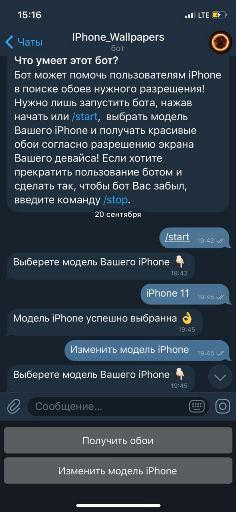
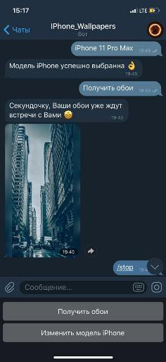
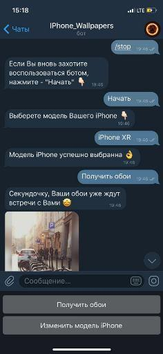

# IPhone_Wallpapers_Bot

## `В настоящий момент сервер, на котором расположен бот, не доступен, соответственно бот тоже.`

Телеграм бот, способный присылать пользователю обои для его Iphone с подходящим разрешением. Имя бота, по которому его можно найти в телеграме - `@IPhone_Wallpapers_Bot`.

## Что такое HD-Phone-Wallpapers-Bot?
Это простой телеграм бот, при взаимодействии с которым, пользователь может получать рандомные красивые обои  для своего IPhone, подходящие по разрешению экрана. 

## Как начать:
1. Найдите `@IPhone_Wallpapers_Bot` в телеграме.
2. Нажмите на кнопку либо `Начать` либо `Старт`, отображающуюся снизу.

Далее просто взаимодействуйте с ботом по средствам всплывающих кнопок.
Для того чтобы бот Вас навсегда забыл, отправьте ему команду `/stop`.

***

Бот создан на современном асинхронный фреймворке - "aiohttp". За счет этого, обработка множетва одновременных запросов, не ставят бота "в тупик". Он своевременно осуществляет обратную связь пользователю, "узким горлышком" по скорости является обращение внутренних частей логики бота к внешнему [API](https://picsum.photos/ ""), огромное спасибо данному сервису, который на бесплатной основе способен возвращать прекрасные картинки нужного разрешения (в данном проекте эти картинки использовались как обои для различных моделей iPhone).
***
Небольшой пример использования:

